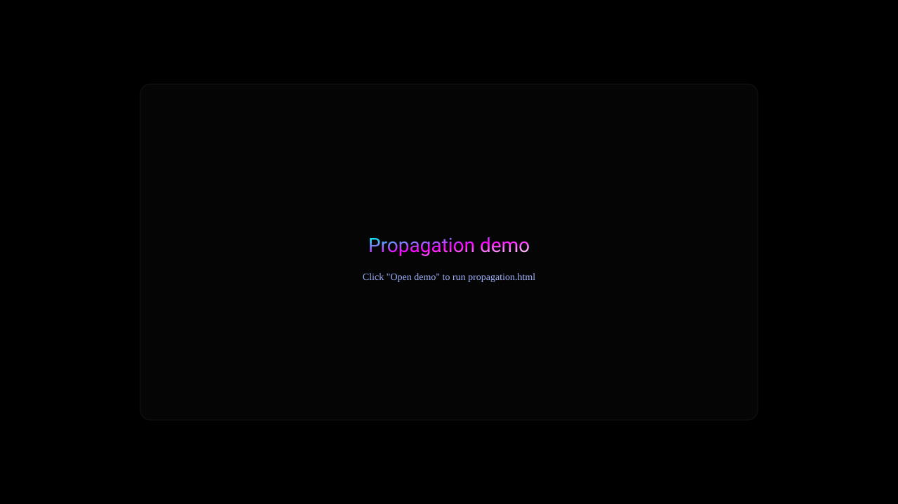

# Propagation — Node Network demo

Polished interactive WebGL demo of a large node/signal network built with three.js. This single-file demo (propagation.html) shows neuron-like firing, Hebbian plasticity, and a tunable signal propagation model intended for recordings and browser-hosted demos.



Live demo

- If GitHub Pages is enabled for this repository the demo will be available at: https://balbaks.github.io/propagation/
- This repo now includes a GitHub Actions workflow to automatically publish the demo on push to `main` (see .github/workflows/pages.yml).

Quick description

- Single-file interactive demo: `propagation.html`
- Controls: sliders for node count, signal speed/strength, threshold, decay, plasticity; transport buttons (pause/reset/burst); click/spacebar injections; cinematic mode.
- Built for spectacle and performance: instanced meshes, spatial bucketing for neighbor computation, bloom/postprocessing.

How to run locally

Option A — quick (open file)

1. Open `propagation.html` in a modern browser (Chrome/Edge/Firefox). For best results use a browser that supports ES modules and WebGL2.

Option B — serve via a tiny static server (recommended to avoid CORS / import map issues)

1. From the repo root:

```sh
python3 -m http.server 8000
# or
npx http-server -p 8000
